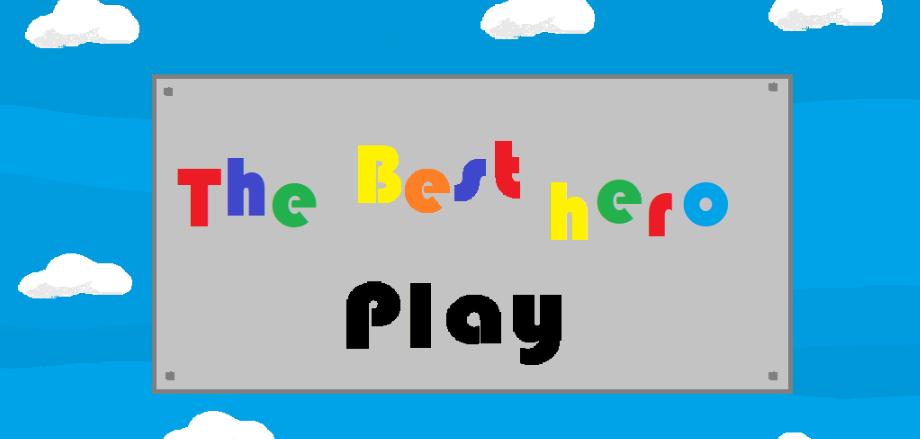
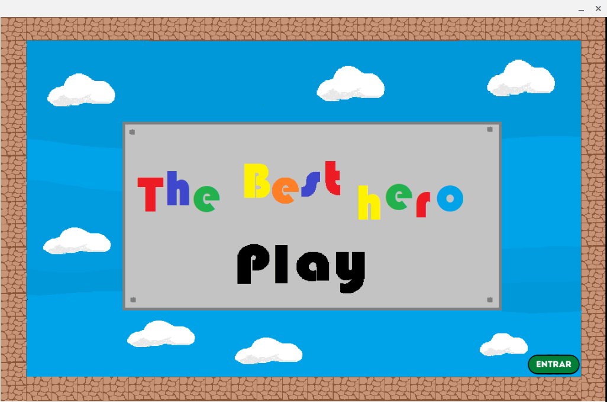
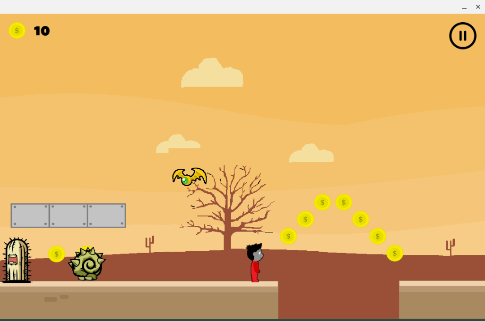
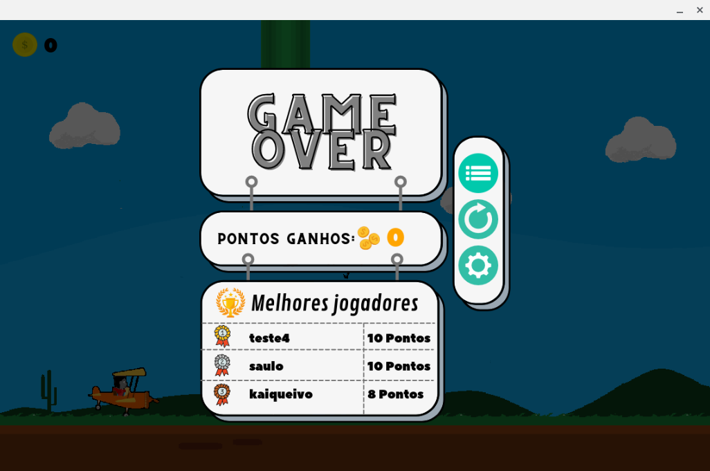
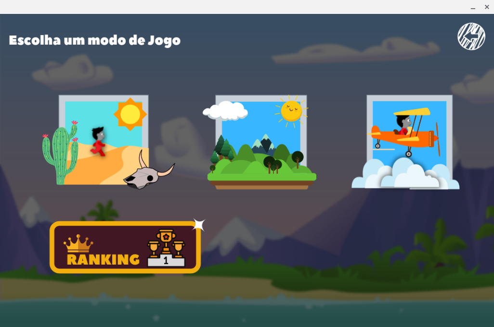
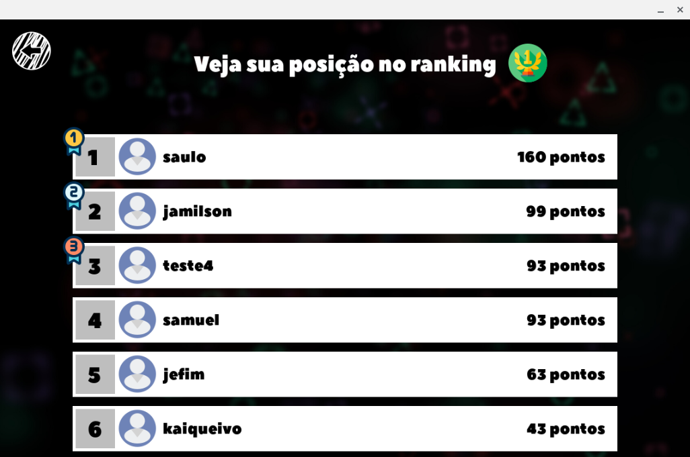
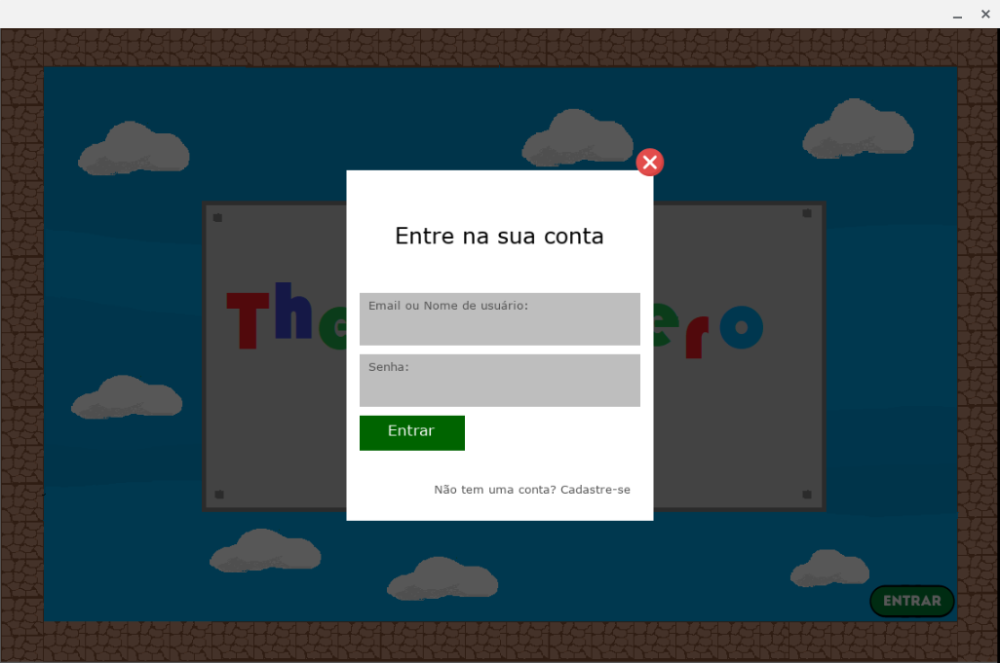
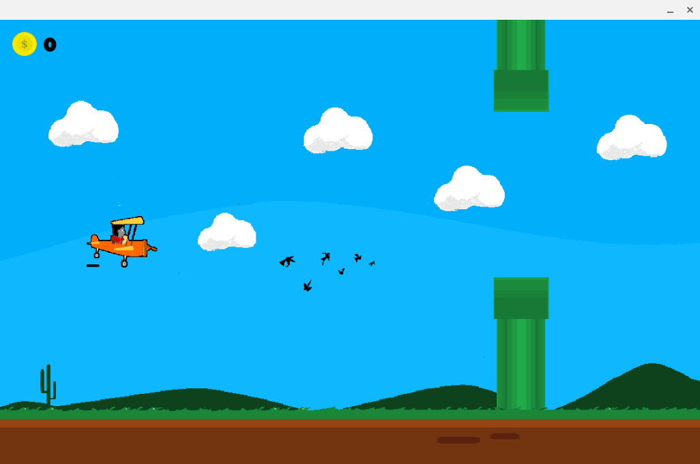
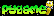
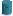

<p align="center">
    
</p>


  


------------------------------------
## Índice

* [Sobre](#sobre)
* [Funcionalidades](#funcionalidades)
* [Layout](#layout)
* [Como Executar](#como-executar)
* [Tecnologias](#tecnologias)
* [Autores](#autor)
* [Licença](#licenca)
* <a href="#" target="_blank">🎮 Jogo em python ---- Em desenvolvimento ⌛ ----</a>


------------------------------------

## 💻 Sobre <a id="sobre"></a>
 
 🎮 Jogo relativamente simples desenvolvido em python usando a bibliotera <a href="https://www.pygame.org/news">Pygame</a>. Alguns cenários do <i>The best Hero</i> foi construído/desenvolvido baseando-se na jogabilidade e temática do  clássico <a href="https://pt.wikipedia.org/wiki/Super_Mario_World">super mario world</a>. O jogo não foi totalmente finalizado, estando em uma versão alfa e podendo apresentar bugs.


<br>

------------------------------------

## ⚙️ Funcionalidades <a id="funcionalidades"></a>
1. ✅ Compatível com qualquer sistema operacional que suporte o python
2. ✅ Design e animações
3. ✅ Sistema de ranking e pontuações
4. ✅ Jogabilidade simples, permitindo que qualquer pessoa jogue sem grandes dificuldades


------------------------------------

## 🎨 Layout <a id="layout"></a>


<p>*O layout da janela do jogo não é responsiva e necessita de uma altura mínima de 720px </p>

<strong>Tela Inicial</strong>

<br><br>

<strong>Mapa do deserto</strong>

<br><br>

<strong>Mini tela de GameOver</strong>

<br><br>

<strong>Esolher modo de jogo</strong>

<br><br>

<strong>Sistema de rankiamento</strong>

<br><br>

<strong>Login e cadastro</strong>

<br><br>

<strong>Mapa baseado no Flappy Bird</strong>

<br><br>


------------------------------------

## 🧩 Como Executar <a id="como-executar"></a>

O executável do jogo ainda não está disponível. No entanto, sua execução é bem simples.

```
# Clone o repositório
$ git clone https://github.com/Saulo-Felipe/The-Best-Hero

# Baixe as dependencias
$ pip install pygame
$ pip install psycopg2

# Para executar, navegue até o diretório baixado e execute:
$ python main.py

```

------------------------------------

## 🤖 Tecnologias <a id="tecnologias"></a>

Para o desenvolvimento desse jogo, foram utilizadas as seguintes tecnologias: 

* Python </img>
* Pygame </img>
* Psycopg2 </img>
* Ferramentas para criação e edição de imagens: Gimp, Paint e Figma

------------------------------------

## 👨 Autores <a id="autor"></a>

<p align="center">➡️ Criado e desenvolvido por <strong>4 (incluindo eu) Integrantes </strong> do meu grupo de estudantes de Ciência da Computação 🧑‍💻.</p>

------------------------------------

## 📜 Licença <a id="licenca"></a>

<p align="center">Todos os direitos reservados ©Copyright</p>